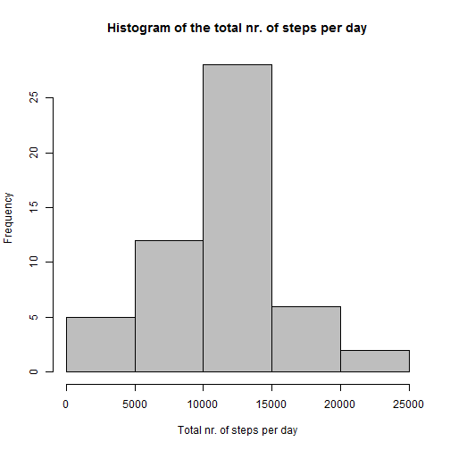
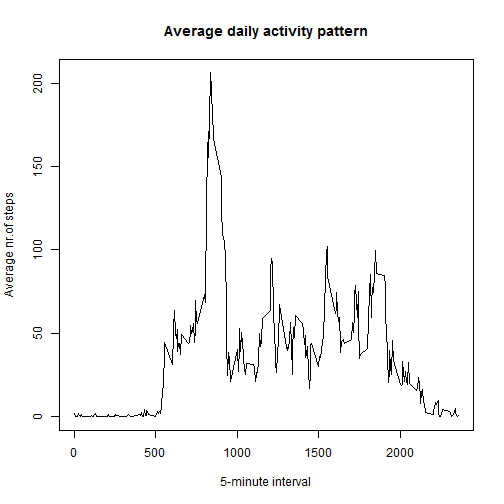
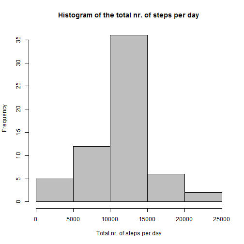
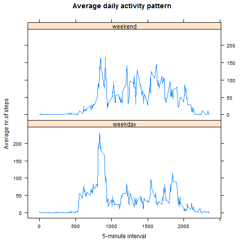

This report is about the data from a personal activity monitoring device, collected from an 
anonymous individual during the months of October and November, 2012 and include the number 
of steps taken in 5 minute intervals each day. The variables included in this dataset are:

* steps: Number of steps taking in a 5-minute interval (missing values are coded as NA);

* date: The date on which the measurement was taken in YYYY-MM-DD format;

* interval: Identifier for the 5-minute interval in which measurement was taken.

## Loading and preprocessing the data

Load the data from the *activity.csv* file and create a dataset with the missing values removed.

```r
moveData <- read.csv('activity.csv')
moveDataR <- na.omit(moveData)
```


## What is mean total number of steps taken per day?
1. First lets calculate the total number of steps taken per day, 
using the *dplyr* package - group by date and sum over the step numbers:

```r
library(dplyr)
stepsPerDay <- moveDataR %>% group_by(date) %>% summarise(sumSteps = sum(steps))
```

2. Now lets make a histogram of the total number of steps taken each day:

```r
hist(stepsPerDay$sumSteps, main = "Histogram of the total nr. of steps per day", 
        xlab = "Total nr. of steps per day", col = "gray")
```

 

3. The mean and median of the total number of steps taken per day can be seen below:

```r
mean(stepsPerDay$sumSteps)
```

```
## [1] 10766.19
```

```r
median(stepsPerDay$sumSteps)
```

```
## [1] 10765
```


## What is the average daily activity pattern?
1. To make a time series plot (i.e. type = "l") of the 5-minute interval (x-axis) 
and the average number of steps taken, averaged across all days (y-axis), we 
need to group the data by the interval and calculate the mean of the steps:

```r
stepsPerInt <- moveDataR %>% group_by(interval) %>% summarise(avgSteps = mean(steps))
```
Now lets show the time series:

```r
plot(stepsPerInt$interval, stepsPerInt$avgSteps, type = "l", 
     main = "Average daily activity pattern", 
     xlab = "5-minute interval", ylab = "Average nr.of steps")
```

 

2. Now we calculate which 5-minute interval, on average across all the days 
in the dataset, contains the maximum number of steps:

```r
ind <- which.max(stepsPerInt$avgSteps)
paste("The interval number is:", stepsPerInt[ind, 1])
```

```
## [1] "The interval number is: 835"
```


## Imputing missing values
There are a number of days/intervals where there are missing values (coded as NA). 
The presence of missing days may introduce bias into some calculations or summaries of the data.

1. We can calculate the total number of missing values in the dataset 
(i.e. the total number of rows with NAs) by just subtracting the number of rows 
of the original dataset and the dataset with the missing values omitted:

```r
paste("The number of missing values is", nrow(moveData)-nrow(moveDataR))
```

```
## [1] "The number of missing values is 2304"
```

2. Now we will devise a strategy for filling in all of the missing values in the dataset. 
We will use the mean for the 5-minute intervals calcuated from the dataset with 
the missing values removed, which was already computed and stored in the 
*stepsPerInt* variable:

```r
head(stepsPerInt)
```

```
## Source: local data frame [6 x 2]
## 
##   interval  avgSteps
## 1        0 1.7169811
## 2        5 0.3396226
## 3       10 0.1320755
## 4       15 0.1509434
## 5       20 0.0754717
## 6       25 2.0943396
```


3. Now we create a new dataset that is equal to the original dataset 
but with the missing data filled in.  
First lets calulalate the part of the data where NAs are present:

```r
partNAs <- moveData[which(is.na(moveData)),]
```
Now lets replace the missing step numbers in a for loop, based on the averages calculated before:

```r
for (i in 1:nrow(partNAs)) { 
  partNAs[i,1] <- stepsPerInt[which(stepsPerInt$interval == partNAs[i,3]), 2]
}
```
And finally we create a new dataset with the rows containing NAs 
in the original dataset replaced:

```r
moveDataN <- moveData
moveDataN[which(is.na(moveData)),] <- partNAs
```

4. If we make a histogram of the total number of steps taken each day and 
calculate and report the mean and median total number of steps taken per day 
again on the new imputed dataframe, we can see that the change in the histogram 
is that the center bar is higher, meaning that more values are concentrated around the mean:

```r
stepsPerDayN <- moveDataN %>% group_by(date) %>% summarise(sumSteps = sum(steps))
hist(stepsPerDayN$sumSteps, main = "Histogram of the total nr. of steps per day", 
        xlab = "Total nr. of steps per day", col = "gray")
```

 

One can also see, that the mean doesn't change, while the median is now equal to the mean:

```r
mean(stepsPerDayN$sumSteps)
```

```
## [1] 10766.19
```

```r
median(stepsPerDayN$sumSteps)
```

```
## [1] 10766.19
```


## Are there differences in activity patterns between weekdays and weekends?
First we create a list of "weekday" and "weekend" words, corresponding to the dates 
in the new dataframe. For this we use the *lapply* function, which applies an 
anonymous function to determine whether a date is a weekday or weekend. 
Then we convert this list to a factor variable and add it as a new column to the dataset:

```r
w <- lapply(moveDataN[,2], 
            function(x) {
              y <- weekdays(as.Date(x))
              if ((y == "Saturday") | (y == "Sunday")) "weekend" 
              else "weekday"
            }
      )

moveDataN$weekday <- as.factor(as.character(w))
```
Finally a panel plot is shown using the *lattice* library containing a time series plot 
(i.e. type = "l") of the 5-minute interval (x-axis) and the average number of steps taken, 
averaged across all weekday days or weekend days (y-axis). 

```r
stepsPerIntN <- moveDataN %>% group_by(interval, weekday) %>% 
  summarise(avgSteps = mean(steps))
library(lattice)
xyplot(avgSteps ~ interval | weekday, data = stepsPerIntN, type = "l", 
       layout = c(1, 2), main = "Average daily activity pattern", 
       xlab = "5-minute interval", ylab = "Average nr.of steps")
```

 


